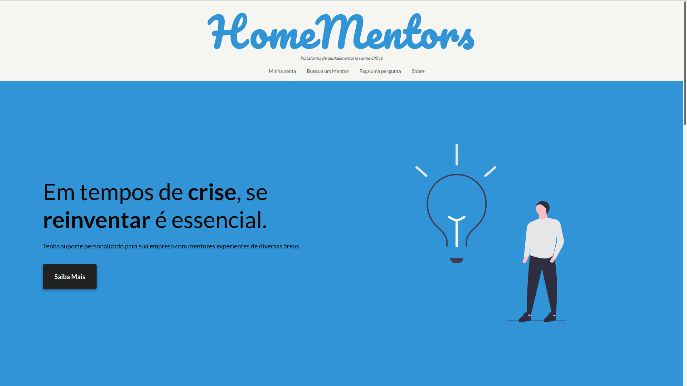

<p align="center">
    
</p>
    <h1 align="center">HomeMentors</h1>

<h4 align="center">
    Plataforma de ajuda&mentoria Home Office
</h4>
<p align="center">
  
  
  
</p>
<p align="center">
  
</p>

## :warning: Atenção
Este é um projeto com a iniciativa do Hackhathon <a href="https://hackingrio.com/hackinghelp/">HACKING+HELP</a>, esta é em si uma versão protótipo. Todo o MVP foi concluído e está pronto para produção.

> Essa é uma versão inicial do README, futuros tópicos e pontos serão colocados assim que novos conteudos forem desenvolvidos.

## :computer: Projeto

HomeMentors é um sistema de mentoria de profissionais de Home Office que estejam atrás de melhorar suas habilidades no setor de vendas e garantir espaço no mercado competidor de comércio online

## :thinking: Motivo

Diante da dificuldade em que setores de bens e serviços se encontram para conseguir manter suas vendas enfrentadas pela paralisação de suas antividades devido a quarentena, muitas empresas estão articulando seu comércio para que não venham a falir ou fechar suas portas. Uma dessas alternativas de negócio que surge e hoje está em alta é a prática do Home Office. Mas o muitas pessoas enfrentam o problema de não possuirem prática ou habilidades que o impulsionem a competir no nicho de mercado.

## Começando...

Essas instruções fornecerão uma cópia do projeto em execução na sua máquina local para fins de desenvolvimento e teste.

### Pré-requisitos

O que você precisa para instalar o software:

```
node v12.x
yarn 1.22.4
git
```

### Instalando o projeto 🚀

Clonando o projeto:

```
git clone https://github.com/KZTN/HomeMentors.git
```

Navegando até a pasta do projeto:

```
cd HomeMentors
```
Crie um arquivo `.env` na raíz do projeto e adicione as seguintes linhas:

```bash
REACT_APP_API_URL= https://homementors-server.herokuapp.com
```

Baixando as dependências do projeto:

```bash
yarn install
```

Rodando o projeto:

```bash
yarn start
```

Visite http://localhost:3000 com o seu navegador para ver o resultado. 🎉

## Como contribuir

- Faça um fork desse repositório;
- Cria uma branch com a sua feature: `git checkout -b minha-feature`;
- Faça commit das suas alterações: `git commit -m 'feat: Minha nova feature'`;
- Faça push para a sua branch: `git push origin minha-feature`.

Depois que o merge da sua pull request for feito, você pode deletar a sua branch.

## :memo: Licença

Esse projeto está sob a licença MIT. Veja o arquivo [LICENSE](LICENSE.md) para mais detalhes.

## Autores

<table align="center">
  <tr >
    <td align="center"><a href="https://github.com/KZTN"><br /><sub><b>Kaio César</b></sub></a><br /><a href="https://github.com/KZTN/HomeMentors?author=kztn" title="Code">💻</a> <a href="#kztn" title="Design">🎨</a></td>
        <td align="center"><a href="https://github.com/CamilleGM"><br /><sub><b>Camille</b></sub></a><br /><a href="https://github.com/KZTN/HomeMentors/commits?author=CamilleGM" title="Docs">📄</a> <a href="#CamilleGM" title="Design">🎨</a></td>
  <tr>
</table>

##

<p align="center">Feito com ♥</p>
